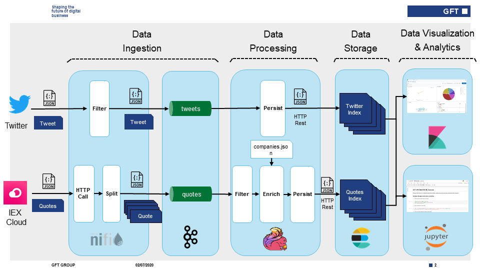

# Big Data Architectures for Investment Banking

Welcome to the "**Big Data Architectures for Investment Banking**" exercise.

In this exercise you will build a complete end to end Big Data Streaming Architecture.

Here you have a detailed schema of end-to-end architecture of the exercises: 

## Course outline

Follow the links below to access each exercise's details, code, etc.

* [Exercise 0: Setup](exercise0_setup)
* [Exercise 1: Data Ingestion](exercise1_data_ingestion)
* [Exercise 2: Data Processing](exercise2_data_processing)
* [Exercise 3: Data Storage](exercise3_data_storage)
* [Exercise 4: Data Visualization](exercise4_data_visualization)
* [Exercise 5: Machine Learning](exercise5_machine_learning)

## Infrastructure reference

| Component | Service | Description | URL/port |
| ------------- | ------------- | ------------- | ------------- |
| **Apache NiFi**  | nifi | Data Ingestion Tool  | http://localhost:8090/nifi  |
| **Confluent Kafka**  | broker | Message Broker  | localhost:9092  |
| **Elasticsearch**  | elasticsearch | Data storage and search engine  | http://localhost:9200  |
| **Kibana**  | kibana | Dashboarding and Elasticsearch dev/admin tool  | http://localhost:5601  |
| **Jupyter**  | jupyter | Notebooks analytics  | http://localhost:8888  |
| **cAdvisor**  | monitor | (Optional) Docker monitoring tool  | http://localhost:8080  |
