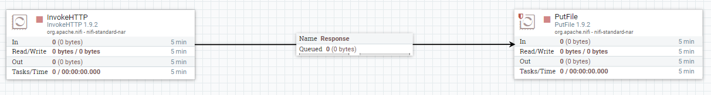

# Exercise 1: Data Ingestion

In this exercise you will connect to your data sources and store the data into a file, using Apache NiFi.


## Data sources

* **IEX Cloud**: https://iexcloud.io/
  * Sign up to create an account
  * Tickers URL: https://cloud.iexapis.com/stable/stock/market/collection/sector?collectionName=Technology&token=your_token
    * **TIP**: Replace "your_token" string with your own token
    * More on this call: https://iexcloud.io/docs/api/#collections
    * It will return a collection of quotes: https://iexcloud.io/docs/api/#quote
  * In the "API Tokens", use the "PUBLISHABLE" type token

* **Twitter**: https://developer.twitter.com/
  * Sign up to create an account, if you don't already have one, or just sign in if you do
  * Create app (more info: https://docs.inboundnow.com/guide/create-twitter-application/)

## Setup (Optional)

> **NOTE**: This setup is only required if you don't want to run the architecture using Docker and you prefer to install it yourself. At your own risk. :-)

Download the latest version of the Apache NiFi binaries (e.g. **nifi-1.11.4-bin.zip**):

* https://nifi.apache.org/download.html

Unzip and run:

```
\nifi-1.11.4\bin\run-nifi.bat
```

Wait about 30 seconds for it to be ready.

## Development

Once it is running, go to http://localhost:8090/nifi

In the NiFi canvas, you will need to create the following:

* Read from IEX Cloud REST Service (**InvokeHTTP** processor) and save to file (**PutFile** processor)
  * You will need the tickers REST URL (see "Data Sources", adding your own token)
  * Set the scheduler to every 30 seconds
  * Link both processors (using the "Response" output), and terminate the rest of the outputs



* Read from Twitter (**GetTwitter** processor) and save to file (**PutFile** processor)
  * You will need the credentials from your Twitter app
  * Link both processors (using the "success" output)


At any time you can run the processors and clicking on the "Start" button (on the left "Operate" box). Or right click on any processor and press "Start" in order to start just that processor.

For more info on how the processors work, read the [Apache NiFi documentation](https://nifi.apache.org/docs.html).

**IMPORTANT**: In case you get stuck, feel free to use the template in the "nifi" folder. You can upload it by righ-clicking on the canvas and select "Upload template", then Drag & Drop the "Template" from the top menu.

