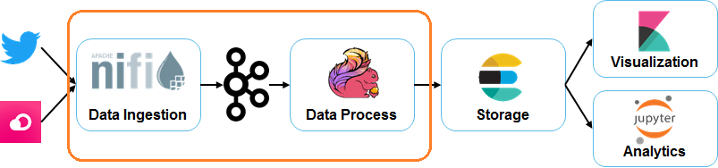

# Exercise 2: Data Processing

In this exercise you will connect Nifi ingestion with Flink data processing



## Setup (Optional)

> **NOTE**: This setup is only required if you don't want to run the architecture using Docker and you prefer to install it yourself. At your own risk. :-)

Download Kafka stack and visualization tool:

* Confluent Kafka stack: [Confluent 5.2.2](http://packages.confluent.io/archive/5.2/confluent-5.2.2-2.11.tar.gz?_ga=2.174462370.1890803127.1563567511-395073974.1561650126)
* Kafka tool & Avro plugin:
	* Download installer : http://www.kafkatool.com/ 
		
Unzip and launch it:

* Zookeeper :
```
confluent-5.2.2\bin\windows\zookeeper-server-start.bat  confluent-5.2.2\etc\kafka\zookeeper.properties
```

* Kafka broker:
```
confluent-5.2.2\bin\windows\kafka-server-start.bat confluent-5.2.2\etc\kafka\server.properties
```

## Development

* **NiFi**
	* Upload Template `nifi/twitter_quotes_upv_ingestor.xml` 
		* Rigth click, select the template that is inside GFTMasterBigDataUPV/exercise2_data_processing/nifi
	* Configure GetTwitter box access credentials (Consumer and Access Token)
	* Configure IEX Cloud token on InvokeHTTP box rest call URL.
	* Configure PublishKafka boxes Kafka URL (port is 9092) and the topic names (tweets and quotes)
	* Configure RouteOnAtribute box and filter over Microsoft, Uber, Twitter, Facebook additionally to the Google already defined.
	* Check that the messages are populated on the topics:
		* Use Confluent Manager
* **Flink processing**
	* Filter the quotes for a list of 10 main technological companies (already defined on appConfig.properties file) 
		* Configure companies filter on `src/main/java/com/gft/upv/flink/proccess/FilterCompanies.java`. You can  get in-scope companies from appConfig.getInScopeCompanies()
	* Enrich quotes messages data adding companies information 
		* Configure enrichment on `src/main/java/com/gft/upv/flink/proccess/EnrichCompany.java`
	* Add those steps to filter the main companies and add companies static data.  
		* Add those  two steps on `src/main/java/com/gft/upv/flink/StreaminStockJob.java`
* **Connfluent Manager for Output Visualization**
	* Connect  to quotesEnriched topic and see output messages.

In case you need help, you can check Flink API here --> https://ci.apache.org/projects/flink/flink-docs-release-1.8/dev/datastream_api.html
