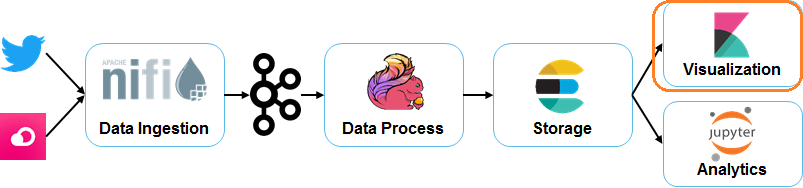
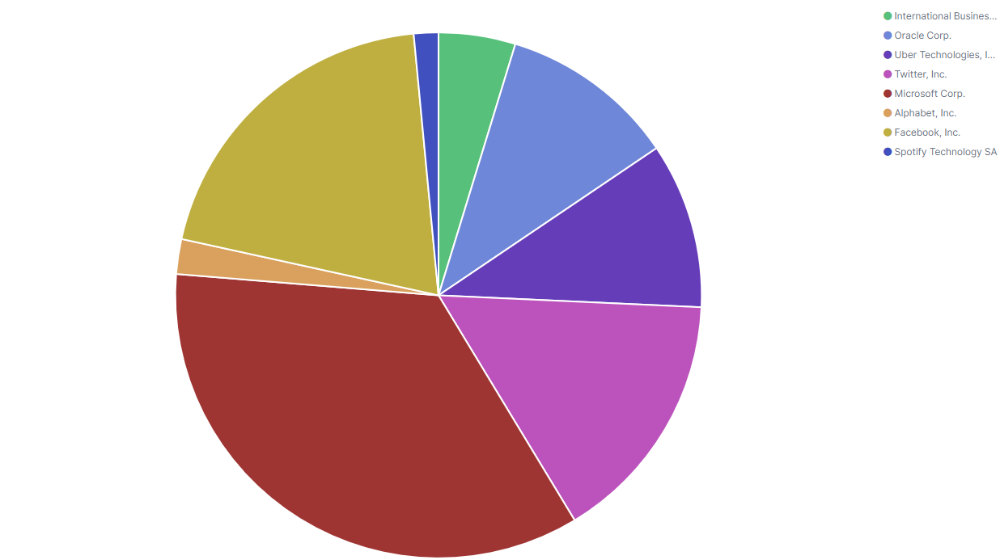
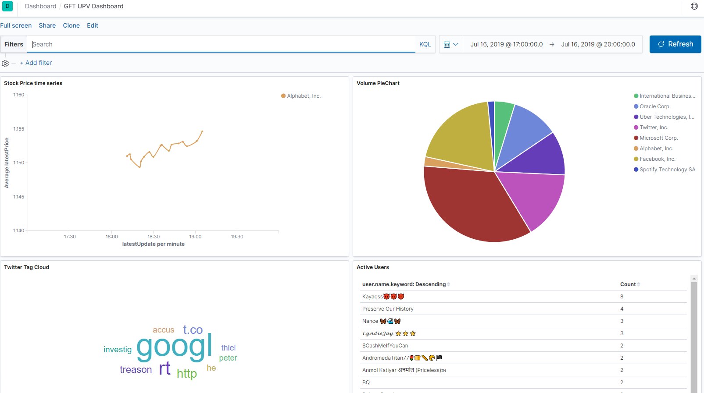

# Exercise 4: Data Visualization

In this exercise you will visualize stored data and create a dashboard.

## Development
* Enter on Kibana --> http://localhost:56001
* Go to Visualization --> Add visualization
* Create two visualization Panes over quotes index (remember to Save the visualization for every pane)
	* Create a Line Visualization to show price evolution of Google Company (remember to Save the visualization).
  * **Hints**:
		* Choose average latestPrice on Y axis
		* Add two buckets one based on latestUpdate and other based on significant terms over companyName.
		* Filter on google.
		* Configure absolute time filter to the time where data was ingested.
		* Tune Metrix and axes.
	
	* Add a Pie Chart to show sum of latestVolume for every company (put the size to 10)
	

* Create two visualization Panes over twitter index (remember to Save the visualization for every pane)
	* Create TagCloud based on text field selecting 10 most common terms
	
	* Add a Data Table over twitter index with the 10 most active users (Selecting aggregation over user.name.keyword)
	

* Finally integrate four panes on a Dashboard (Go to Dashboard Section and select your previous panes)
	
